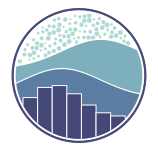

<h1 align="center">Hi 👋, I'm Soheil</h1>
<h3 align="center">A passionate Data Scientist from Iran</h3>

# 💫 About Me:
I have been an MSc student in the field of computer engineering and the subfield of Artificial Intelligence and Robotics at Azad University since 2020. Throughout my academic years, I worked for an insurance broker company.
I'm very passionate about machine learning and deep learning, so I have been participating in Coursera, Data Camp, and Dayche courses. I worked on machine learning projects and used Python during my classes.

🔭 I’m currently looking for a job in Data Science or Machine Learning  
🔭 I’m currently working on my master's degree thesis 
🌱 I’m currently learning Convolutional Neural Networks, Sequence Models, Django, FastAPI
 

## 🌐 Socials:

 
 

# 💻 Skills:

 
 

# 📊 GitHub Stats:
 
 

---

